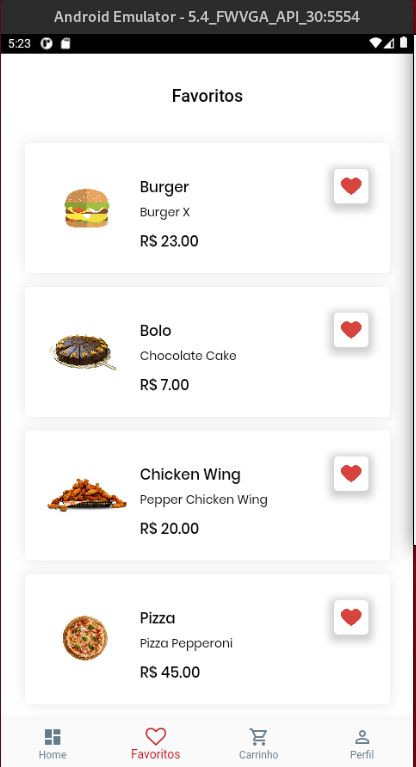
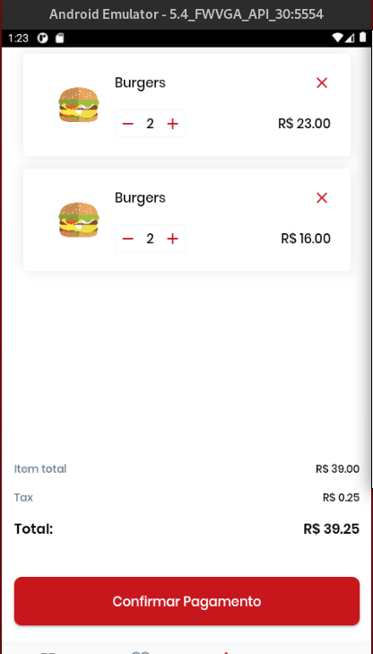
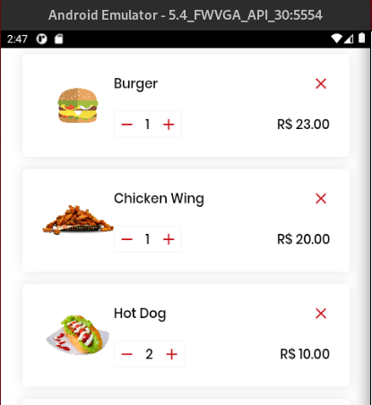
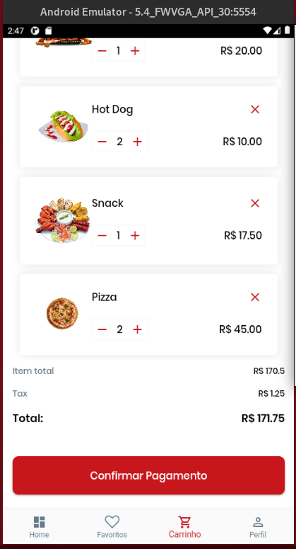

# FoodAPP (Flutter)

## Tarefa

- Nesses vídeos ainda não falamos de gerenciamento de estados, então acredito que vai ser bem fácil para vocês fazerem essa tela !

- Criar os widgets e mostrar a última tela do layout do Figma> Tela de Favoritos !

- Link das telas feitas no Figma: https://www.figma.com/file/uZOJzn5adQCV2HuLGNYfGY/Food-App?node-id=0%3A1

- De  preferência colocar no github e enviar o link , com a descrição no readme.md do que vcs fizeram !

## Execução

### Tela de favorito 

*Tela de favorito criada.*

-----

### Outras telas (testes)
- Add. produtos.
- Implementação de função para calculo de preço toral.

*Tela original.*

*Tela modifica 1.*

*Tela modifica 2, e preço calculado.*

