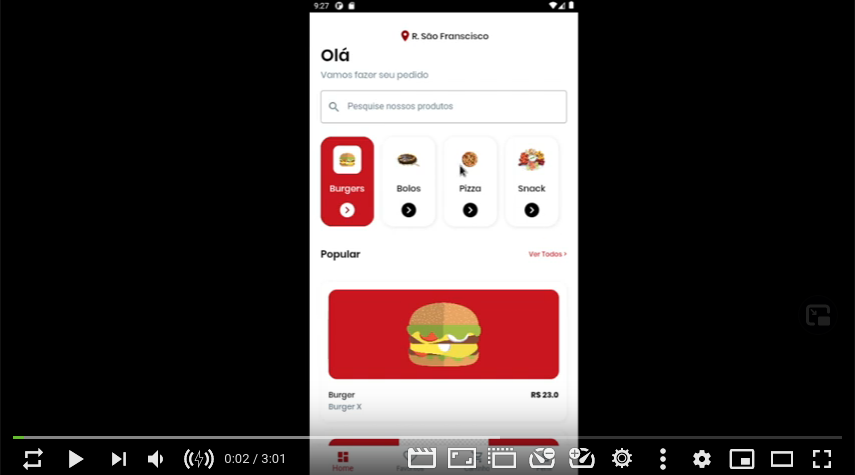

# FoodAPP (Flutter)

## Tarefa 1

- *Vídeo dessa tarefa e da tarefa 2 no final do README.md*

1. Nesses vídeos ainda não falamos de gerenciamento de estados, então acredito que vai ser bem fácil para vocês fazerem essa tela !

2. Criar os widgets e mostrar a última tela do layout do Figma> Tela de Favoritos !

3. Link das telas feitas no Figma: https://www.figma.com/file/uZOJzn5adQCV2HuLGNYfGY/Food-App?node-id=0%3A1

4. De  preferência colocar no github e enviar o link , com a descrição no readme.md do que vcs fizeram !

## Execução

### Tela de favorito 

*Tela de favorito criada.*

-----

### Outras telas (testes)
- Add. produtos.
- Implementação de função para calculo de preço total.

*Tela original.*

*Tela modifica 1.*

*Tela modifica 2, e preço calculado.*

-----
## Tarefa 2

- Vocês devem criar o gerenciamento da tela de favoritos da mesma maneira que vimos nas aulas anteriores, de forma que seja possível favoritar um produto na tela de pedido e esse produto, e os detalhes sobre ele, apareçam na tela de favoritos. Também deve ter a opção de "desfavoritar".

*Execução do APP*