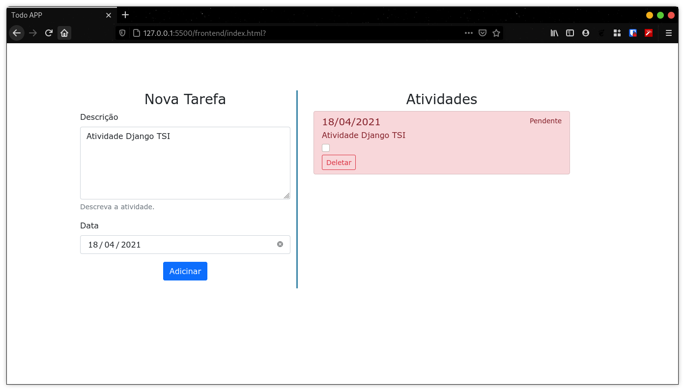

# TodoAPP

## Tarefa

Link da Ideia do projeto:
https://github.com/florinpop17/app-ideas/blob/master/Projects/2-Intermediate/To-Do-App.md

### Em Django: Crie um clássico aplicativo de tarefas em que um usuário pode escrever todas as coisas que deseja realizar.
    
- O usuário pode ver um campo de entrada onde ele pode digitar um item de tarefa.
- Ao pressionar Enter (ou um botão), o usuário pode enviar o item de tarefa e pode ver que está sendo adicionado a uma lista de tarefas
- O usuário pode marcar uma tarefa como concluída
- O usuário pode remover um item de tarefa pressionando um botão (ou no próprio item de tarefa)

#### Rest Framework:
- Criar o CRUD* do projeto django utilizando a API, onde deve ser possível realizar estas operações por uma endpoint.
-  CRUD: Create (Criação), Read (Consulta), Update (Atualização) e Delete (Destruição)

## Execução

*Inserção da primeira atividade.*

*Inserção da segunda atividade. Marcado em vermelho a tarefa pendente mais próxima.*

*Inserção da terceira atividade*

*Inserção da quarta atividade*

*Marcação da atividade com finalizada. As tarefas finalizadas estaram marcadadas em azul.*

*Mais uma atividade marcada com finalizada.*

*Remoção de duas atividade. Foram removidas as atividades não finalizadas.*