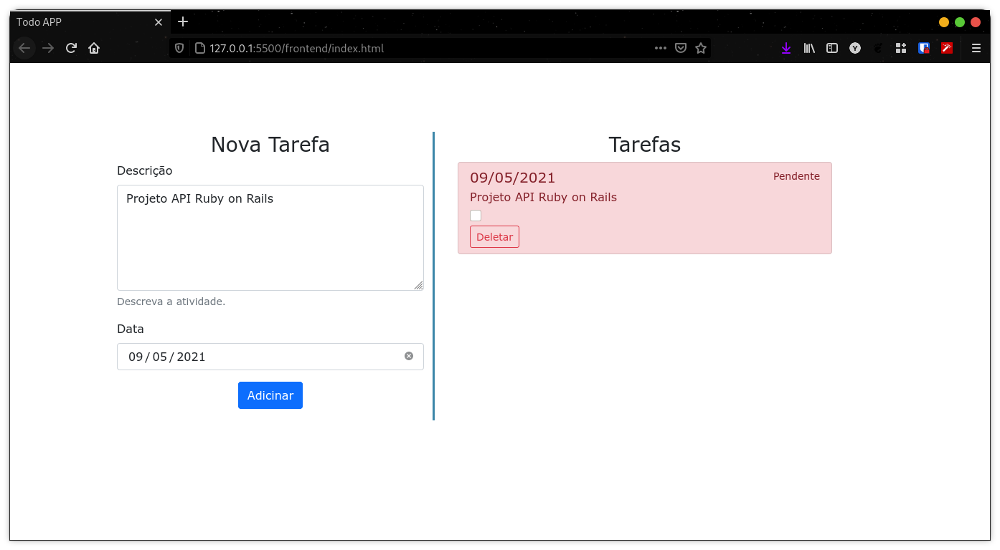
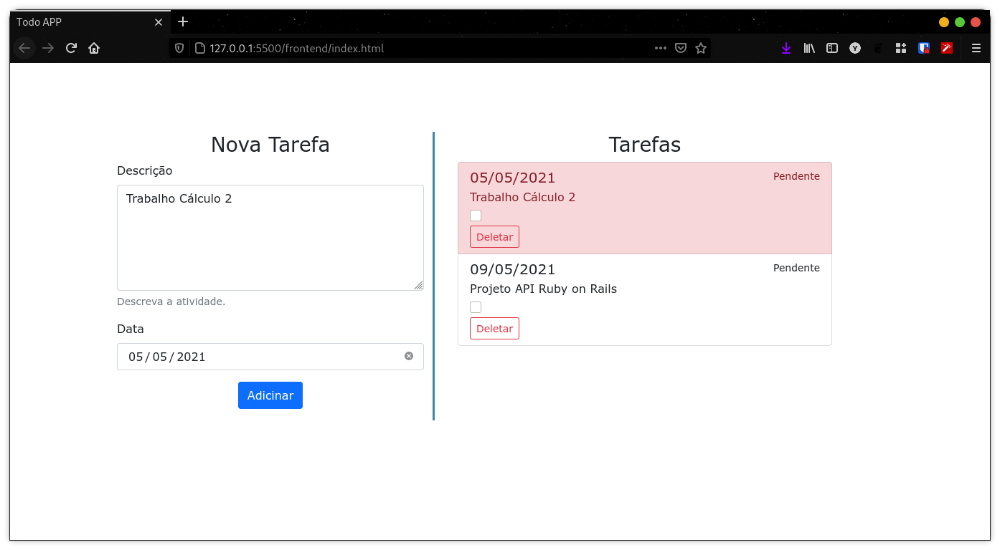
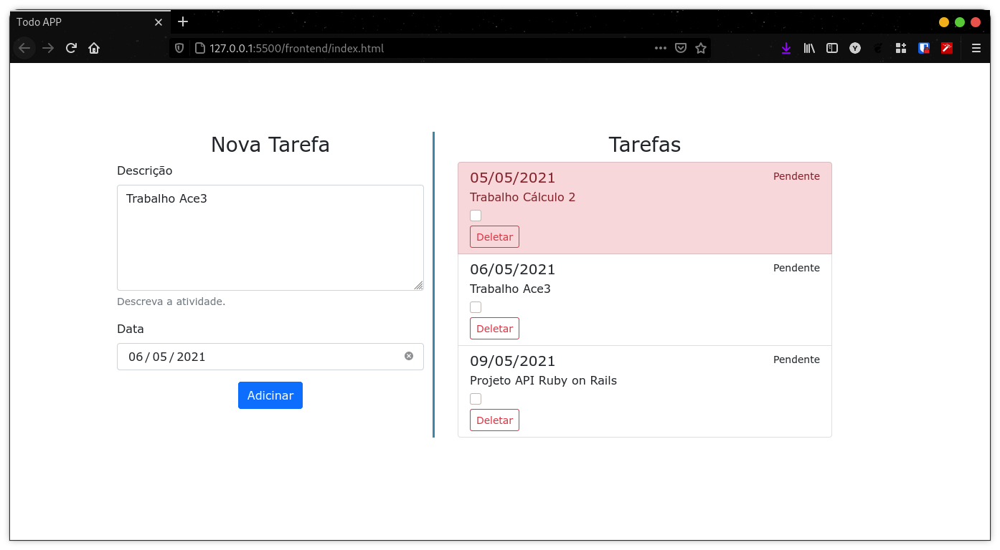
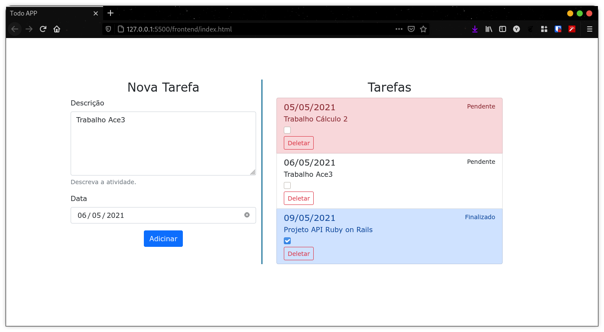
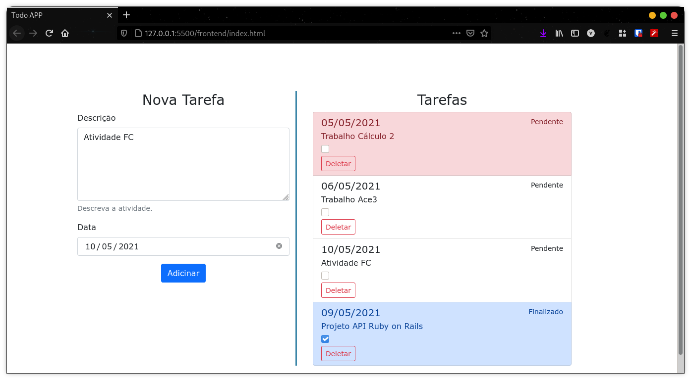
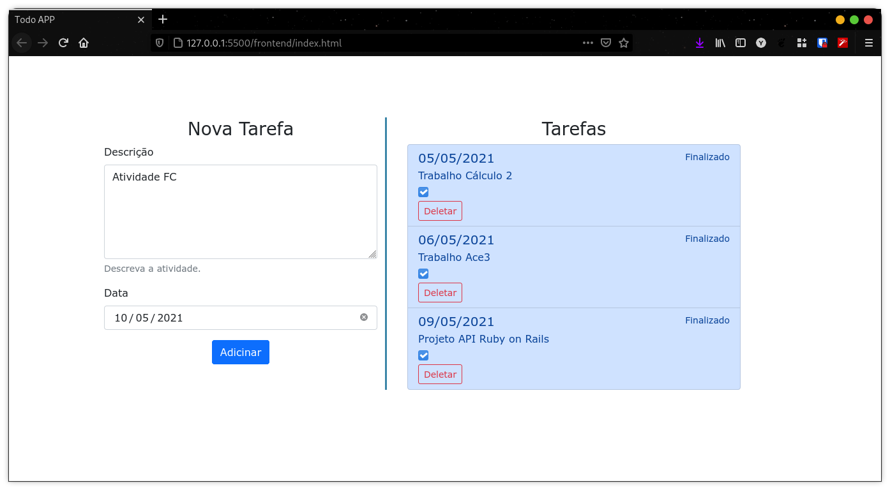

# TodoAPP Ruby on Rails

Tema escolhido: aplicativo de tarefas em que um usuário pode escrever todas as coisas que deseja realizar.
    
- O usuário pode ver um campo de entrada onde ele pode digitar um item de tarefa.
- Ao pressionar Enter (ou um botão), o usuário pode enviar o item de tarefa e pode ver que está sendo adicionado a uma lista de tarefas
- O usuário pode marcar uma tarefa como concluída
- O usuário pode remover um item de tarefa pressionando um botão (ou no próprio item de tarefa)

## Tarefa

### Fazer um CRUD com Rails
- usando qualquer banco de dados, 

- podendo usar qualquer tipo de rota incluindo o resources, que já cria as rotas default e usando o seeds para popular a base de dados.

- A aplicação que vocês vão criar é de livre escolha. Pode ser uma API de estoques, locadora, ToDoList... o que vocês quiserem. Abusem da criatividade;

### Forma de entrega:

Subam o projeto de vocês no GitHub/GitLab/BitBucket e postem o link do repositório. Busquem deixar o repo o mais organizado possível pois vamos rodar o projeto de vocês localmente e testar as rotas e tudo mais :)

### Material

Em anexo, um vídeo que Vitor gravou onde cobre todo o conteúdo que foi dado durante o minicurso.
Vale lembrar que, em caso de atraso na entrega, terá um ponto de decréscimo na nota da atividade. Contudo, não deixem de entregar :)

- https://drive.google.com/file/u/1/d/1rWaypCLnBxw0z_keVpTFQsR_g1RZc4f8/view?usp=drive_web

## Execução

*Inserção da primeira atividade.*

*Inserção da segunda atividade. Marcado em vermelho a tarefa pendente mais próxima.*

*Inserção da terceira atividade*

*Marcação da atividade com finalizada. As tarefas finalizadas estaram marcadadas em azul.*

*Inserção da quarta atividade*

*Remoção de duas atividade FC, última que foi inserida.*

*Marcação de todas as atividade como finalizadas.*